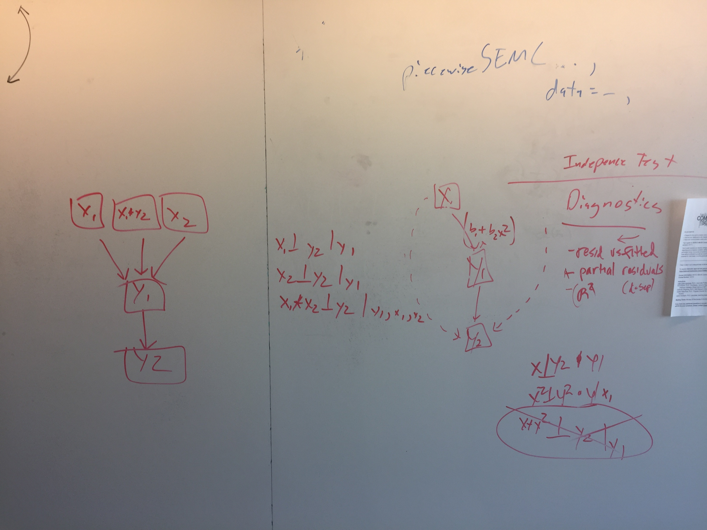
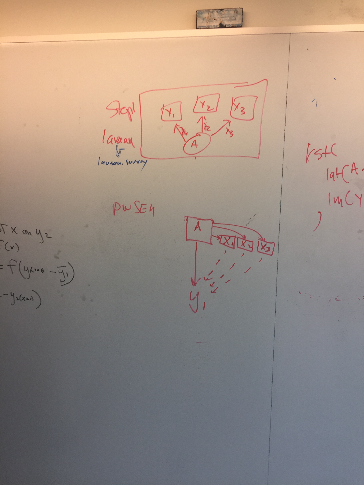
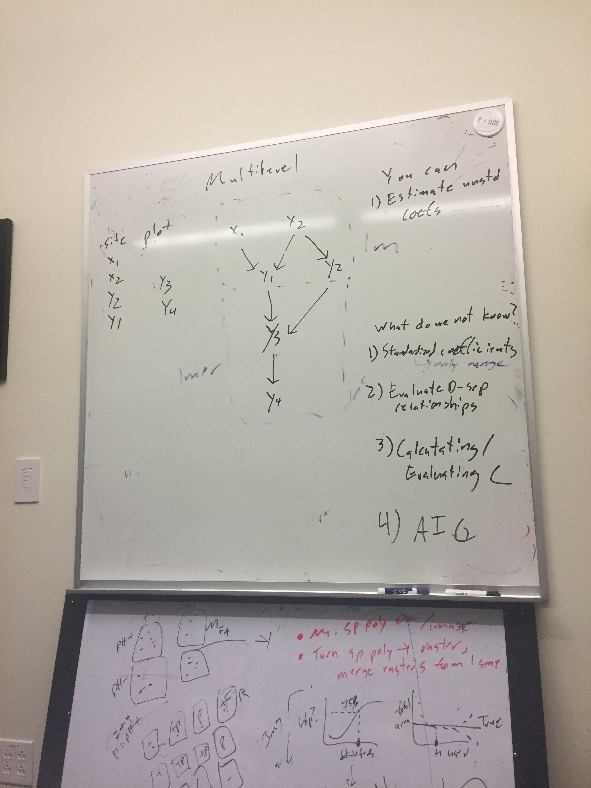
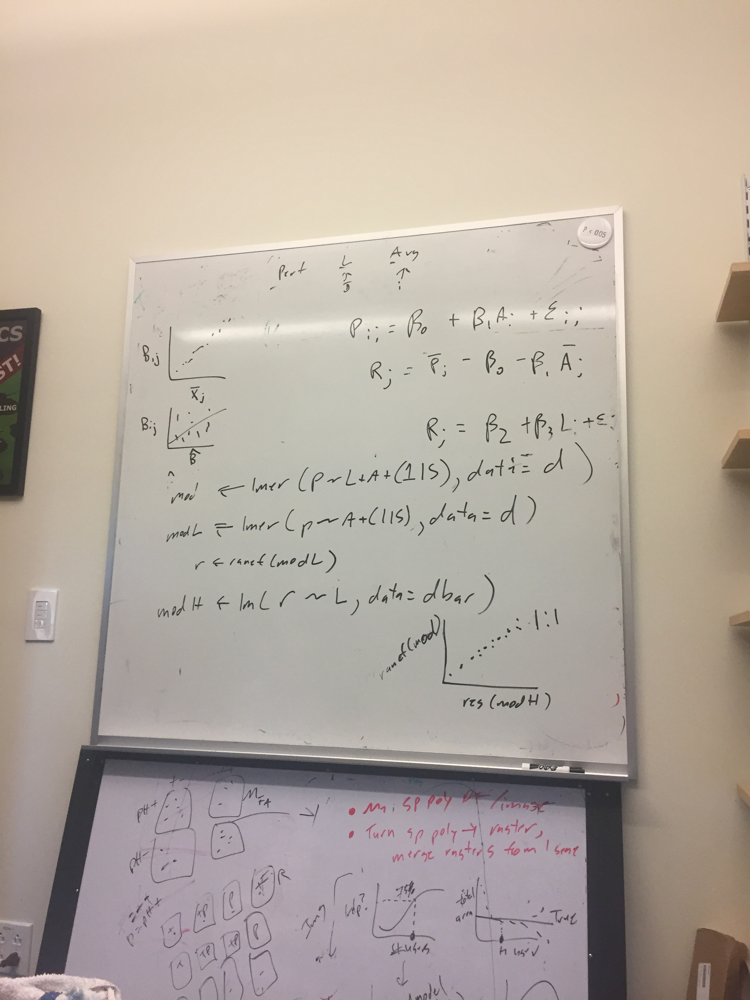
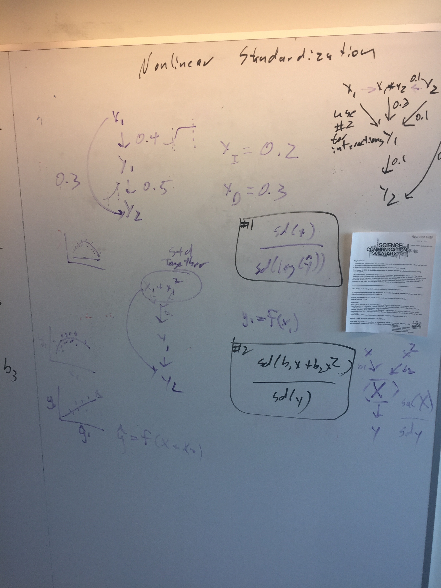
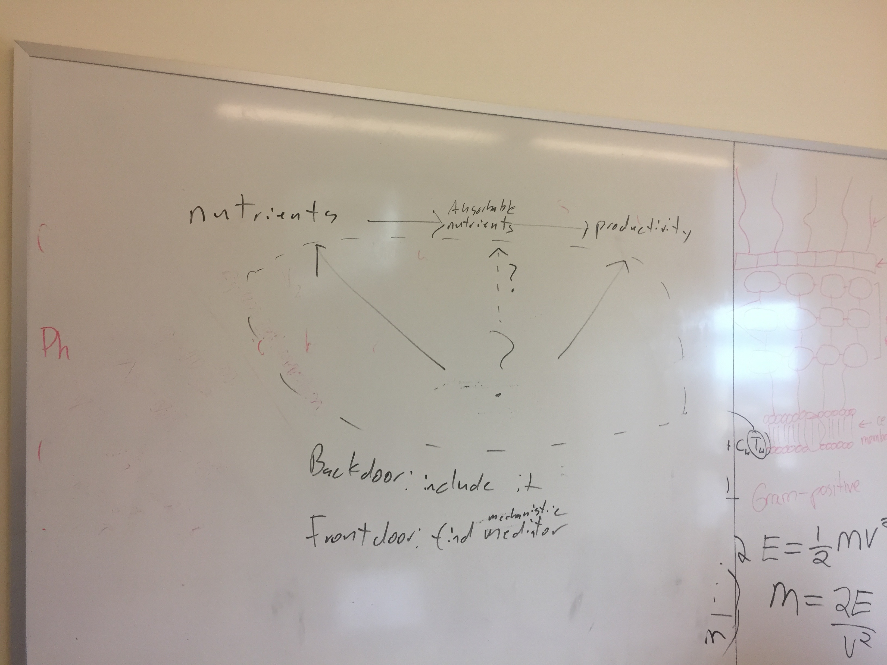
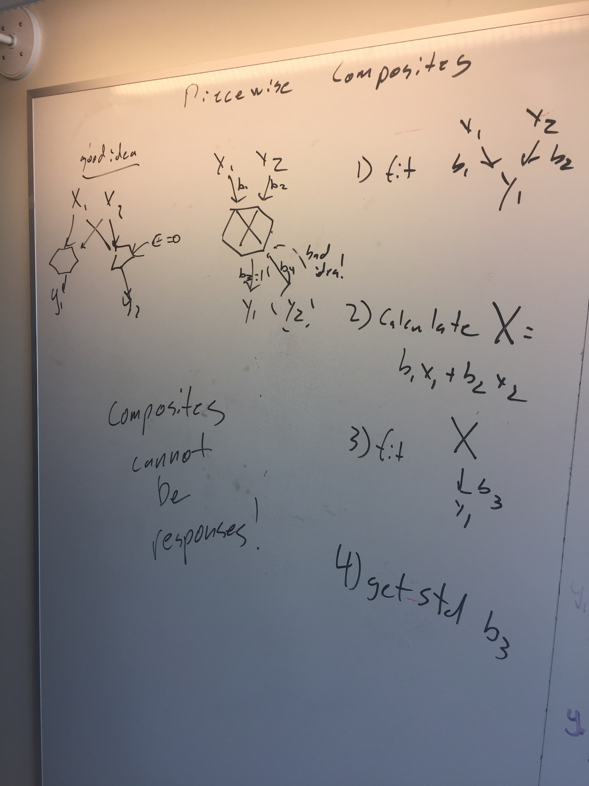

# (APPENDIX) Appendices  {-}

# Agenda and Notes from February Meeting  

0. Setup bookdown x
- Create roadmap for this meeting x
- Create a roadmap for an SEM learner 

1. Formalizing how exogenous variables are included in the basis set x
- Maybe provide an additional output of correlation between exogenous variables  
- But - no reason to include those in calculating Fisher's C

2. Can you statistically compare two C statistics? Yes.  x
  - Use C for LRT  
  
3. GLMs and C-statistics x
  - low hanging urgent fruit  

4. Nonlinearities and the C-statistics x
    - Polynomial terms  
    - Interaction effects  
    - Jim says ignore them, then says don't  
    - ignore, but diagnostics are separate from independence tests  

5. Testing indirect effects  x
- p-values based tests, etc.  
- Nah - don't do p-value based testing
- Can use Jarrett's predict function to get total effect
- Can then subtract direct effect if it is there
- Other tests of indirect pathways need to be done by hand

6. Latent Variables in a Piecewise Framework  x
- Can you use factor scores as another variable in the model

7. Fitting and evaluating True multilevel models  
- In a nutshell, you need to capture those intercepts into a different model in a separate dataset
- Algorithmic solution?
- Talked about it a lot in the context of a single multilevel model
- Where does this enter into SEM?
- We can evaluate d-sep relationships
- We can calculate range standardized coefficients, but not classical Std. Coefs
- We do not know how to properly calculate C
- We do not then know how to translate into AIC, or how to work with BIC

8. Standardized coefficients for nonlinear variables & glms  x  
  - HAHAHAHAHA - man have we failed here so far...
  - But Jim provides hope!
  - And then we nail it 
      - denominator SD uses the link function  
      - Numerator is a block of linear and nonlinear variables combined
  - With interaction effects, need to incorporate block approach

  

9. Prediction with error (maybe with Jon this afternoon?) x  
- i.e. for forecasting  
- Simulation is the answer  
- The problem is random effects structure  
- Perhaps only use fixed effects?  
- And/or sort out random effect usage  
- The biggest problem you will have is nonlinear models

10. Formalization of correlated errors x
- Derived v. estimated parameter?  
- Derived! piecewise estimation handles this  

11. Human-understandable explanation of the front-door and back-door criteria for better model creation x  
- maybe revisit at end of 1st day of a class  
- Think about temporal aspect of causality  
- see picture

12. Categorical variables in a piecewise approach x
- General guidelines  
- Comparison to multigroup modeling?  
- Fit two different SEMs and evaluate if parameters are different
- Constraints not needed?
- Make a table comparing parameters across groups
- Endogenous:  Binomial is a categorical response
- Multiple categorical levels - multinomial logistic regression  
- `multinom` function in `nnet` package
- http://stats.idre.ucla.edu/r/dae/multinomial-logistic-regression/  
  - Standardization is......trickier  

13. Model evaluation in a Bayesian context  ??
- No one so far believe DIC
- Posterior Predictive P-Value
- How do you evaluate a basis set?
- How do you calculate WAIC?
- Classic Bayesian SEM works with Covariance matrices - so, a single likelihood
- Statisticians don't love piecemeal nature of Dsep
- Sum Bayesian p-values?
- Jim says 'good luck with that' - lots of issues, limit to what he can focus on
- Need to talk with a Bayesian statistician
  
14. Composite variables in a piecewise approach x
  - Natural  
  - Fit model with no composite, then refit with derived composite  

15. Roadmap for piecewiseSEM  

16. Teaching roadmap  
- http://www.nwrc.usgs.gov/SEM/ (old)
- http://structuralequations.org (old)  
- http://bit.ly/graceSEM

**MARCHING ORDERS**
  - Jon: Make sure we have addressed issues with glms and c statistic in piecewiseSEM  
  - Jon: Implement standarized coefficients for nonlinear and non-gaussian responses  
  - Jim will validate two-stage latent variable technique with KB  
  - Jim will make indirect effect demos and validate the for glms  
  - Jim will validate the correlated error conclusions  
  - Jarrett will write simulation-based prediction methods/query engine  
  - Jarrett will turn prediction into generalized method for teasing apart indirect effects  
      - One unit change from mean as default? User has to query with range  
      - Compare to direct effects  
      - Maybe specify pathways for query engine?  
  - Jarrett/Jon will flesh out c-stat outline  
  - Jim will flesh out an indirect effects and queries outline  
  - Jim/Jon will outline a Latent and composite variables in piecewiseSEM paper  
  - Jarrett/Jon will make a teaching outline for bookdown site  
  - All will ponder multilevel model issues  